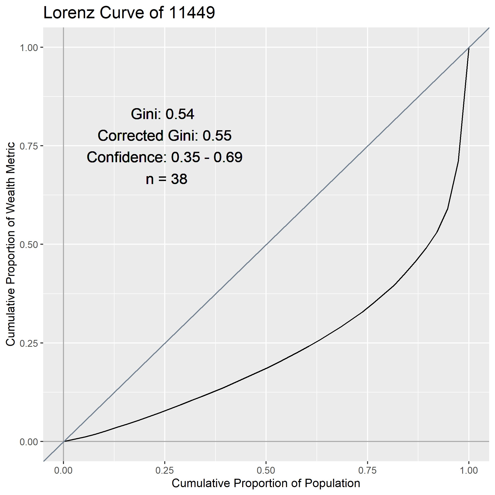
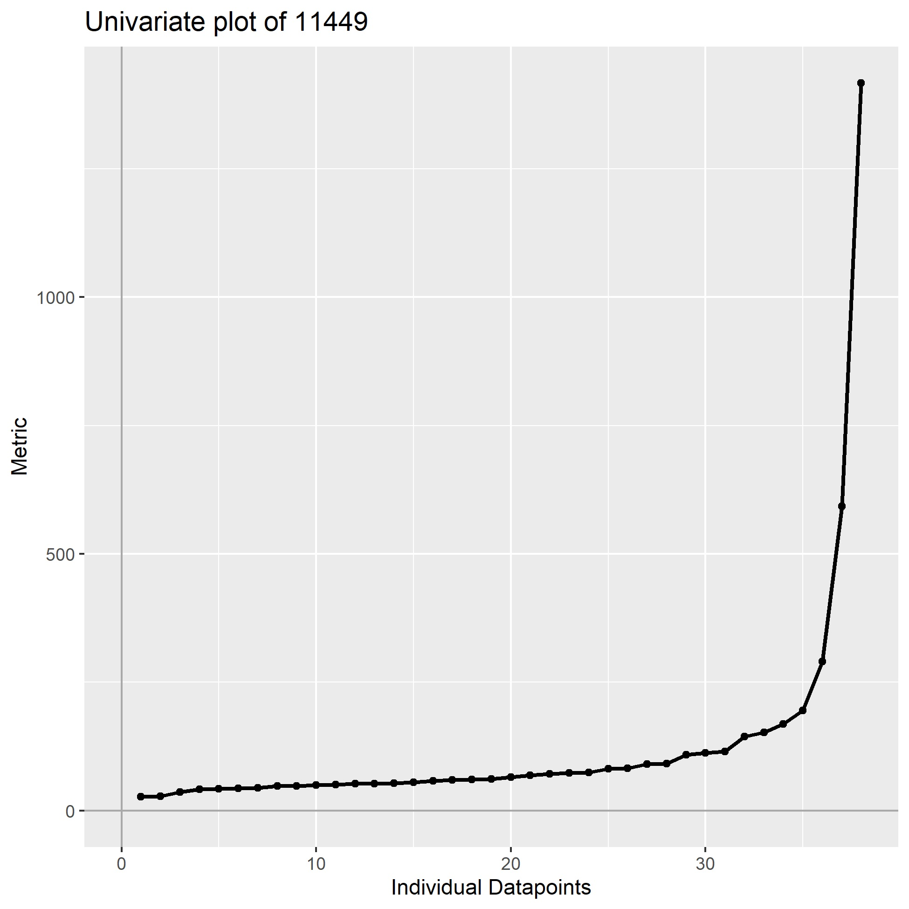
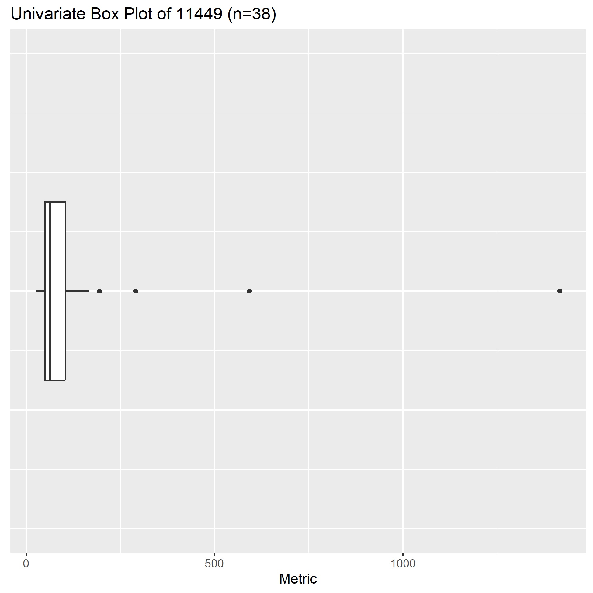
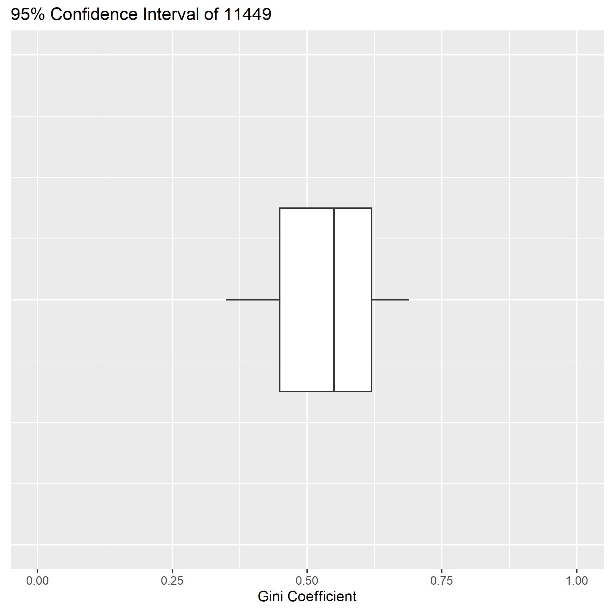

# Gini Automation for Large Datasets
This R code automates the calculation of Gini coefficients and summary statistics across the large datasets. The code requires an input .csv file in the following format (see SampleData.csv):

| Name  | Metric      |
| ----- | ----------- |
| 11444 | 160.1165767 |
| 11444 | 192.3794014 |
| 11444 | 57.26671944 |
| 11444 | 195.2263164 |
| 11445 | 177.3647787 |
| 11445 | 64.85372645 |
| 11445 | 211.2993753 |
| 11445 | 99.88499478 |

"Name" is any string that identifies how data will be grouped; for example, the name of an individual, a place, an archaeological site, a neighborhood, etc; or in this case the unique identifier for a NASA G-LiHT tile (https://doi.org/10.1016/j.jasrep.2020.102543). "Metric" represents the individual datapoints across the "Name" field, for example, income, structure size, etc. Metric does not need to be in ascending order, the Gini function will automatically order this column.

Lines 1-59 will calculate the summary statistics and output to a .csv file "ginibyname.csv" to the working directory. Statistics will not be calculated for "Name" groups with sample sizes under 10, although this value can be adjusted in the code.

| Name  | Gini | Corrected Gini | Sample Size | Mean   | Range   | Std Deviation | ... | Lower Gini | Higher Gini |
| ----- | ---- | -------------- | ----------- | ------ | ------- | ------------- | --- | ---------- | ----------- |
| 11449 | 0.54 | 0.55           | 38          | 129.03 | 1389.32 | 232.70        | ... | 0.35       | 0.69        |
| 11450 | 0.60 | 0.61           | 67          | 200.73 | 1323.67 | 290.31        | ... | 0.54       | 0.67        |
| 11456 | 0.52 | 0.57           | 11          | 107.75 | 540.17  | 146.34        | ... | 0.28       | 0.70        |
| 11457 | 0.38 | 0.38           | 342         | 73.96  | 417.12  | 58.91         | ... | 0.35       | 0.41        |
| 11458 | 0.29 | 0.31           | 15          | 47.96  | 106.84  | 27.99         | ... | 0.23       | 0.42        |
| 11459 | 0.41 | 0.43           | 35          | 71.39  | 420.04  | 86.97         | ... | 0.23       | 0.56        |

Beginning with line 63, the code will create a "giniplots" folder in the working directory and loop through each group in the "Name" field to generate publication quality charts summarizing the Gini data. These charts are based on similar outputs from a spreadsheet by Adrian Chase.

The "lorenz" folder contains Lorenz curves for each "Name" group:

The "univariate" folder contains line plots of each group's individual datapoints in ascending order:

The "box" folder shows the same data in a box plot:

The "confidencebox" folder summarizes the corrected Gini coefficients with the lower and upper confidence values:

